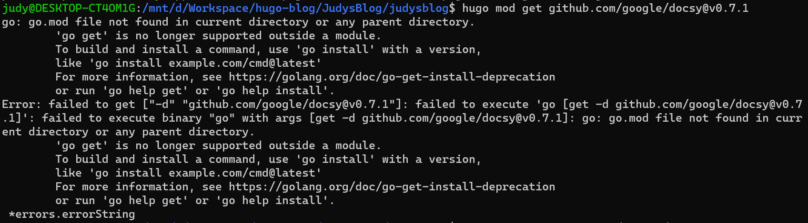

# Golang


## go: go.mod file not found in current directory or any parent directory

在嘗試安裝模組時出現問題，需要先 init module 再下 `mod get`

```
go mod init <current-dir-name>
```

https://www.techdatao.com/article/detail/57.html



## GOROOT and GOPATH

設置環境變數的方法
```
go env -w GO111MODULE=auto
```